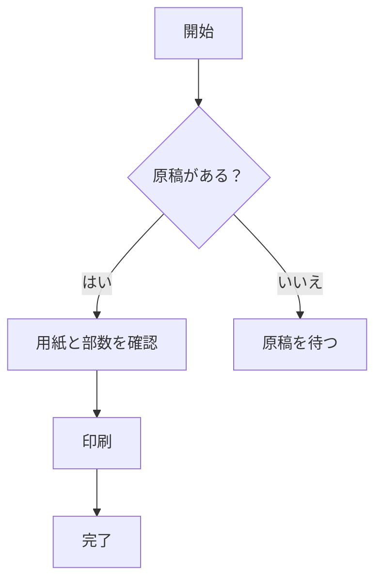
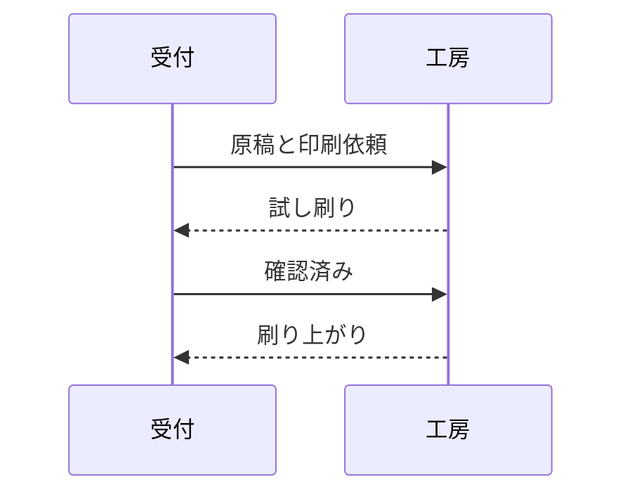

# 星見工房の印刷受付

架空の工房の受付と印刷の流れです。

## 受付の流れ

```mermaid
flowchart TD
    A[開始] --> B{原稿がある？}
    B -->|はい| C[用紙と部数を確認]
    B -->|いいえ| D[原稿を待つ]
    C --> E[印刷]
    E --> F[完了]
```

## 受付と工房のやりとり

```mermaid
sequenceDiagram
    participant A as 受付
    participant B as 工房
    A->>B: 原稿と印刷依頼
    B-->>A: 試し刷り
    A->>B: 確認済み
    B-->>A: 刷り上がり
```

## 描けない図の確認

次の図は意図的に壊してあります。原文が枠に残り、印刷前の確認に表示されます。

```mermaid
flowchart LR
    A[閉じ括弧がありません
```
